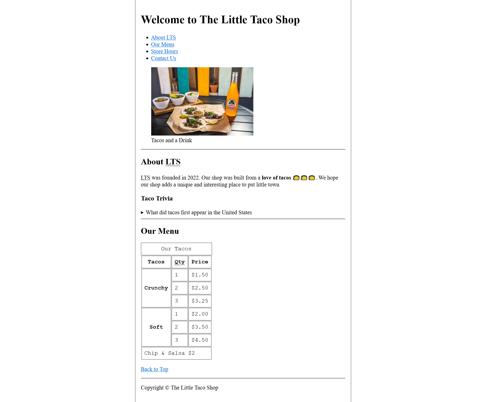
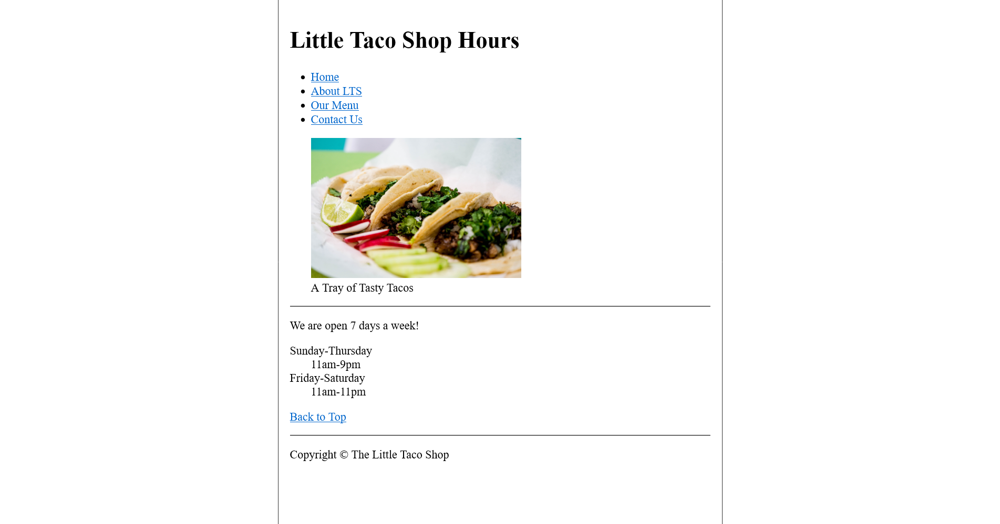
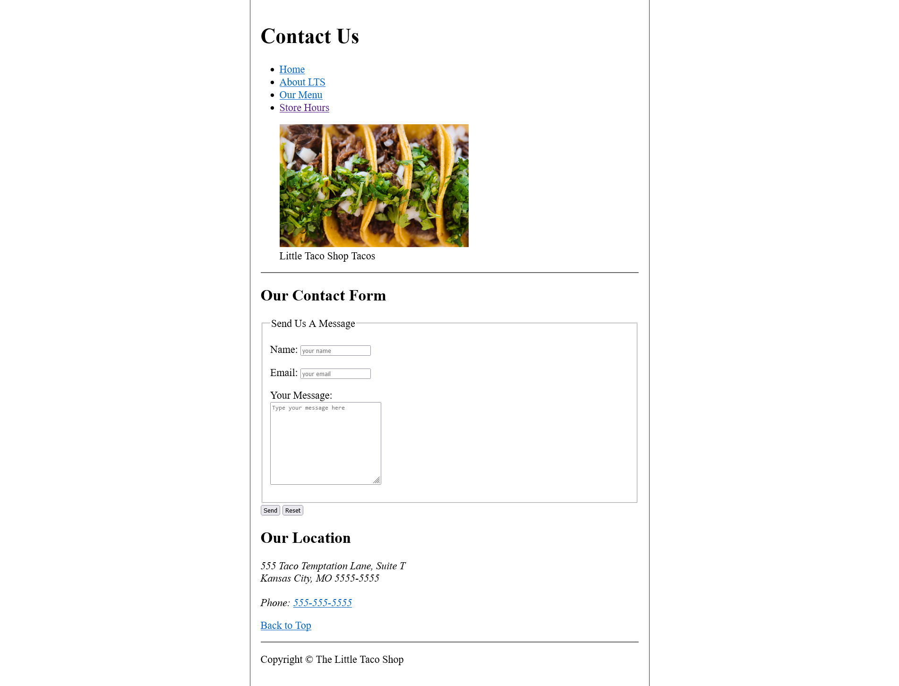

# HTML Project for Beginners - The Little Taco Shop Website

This is a practice project of a html tutorial on YouTube Channel - Dave Gray. I use the knowledge I have gained from the [HTML for Beginners](https://www.youtube.com/playlist?list=PL0Zuz27SZ-6OlAwitnFUubtE93DO-l0vu) tutorial series to build this website for The Little Taco Shop. 

## Overview

### Screenshot





## My process

### Built with

- Semantic HTML5 markup
- HTML5 Table
- HTML5 Form
- HTML5 Description List

### What I learned

- use "figure" element
```html
<figure>
    
    <figcaption>Tacos and a Drink</figcaption>
</figure>
```

- use "details" & "cite" element
```html
<details>
    <summary>What did tacos first appear in the United States</summary>
    <p>Lorem, ipsum dolor sit amet consectetur adipisicing elit. Impedit officia natus cum iure rem maiores error magni velit earum placeat? (Source: <cite><a href="https://www.smithsonianmag.com/arts-culture/where-did-the-taco-come-from-81228162/" target="_blank">Smithsonian Magazine</a></cite>)
    </p>
</details>
```

- use "description list" & "time" element
```html
<dl>
    <dt>Sunday-Thursday</dt>
    <dd><time datetime="11:00">11am</time>-<time datetime="21:00">9pm</time></dd>
    <dt>Friday-Saturday</dt>
    <dd><time datetime="11:00">11am</time>-<time datetime="23:00">11pm</time></dd>
</dl>
```

## Tutorial Data

- [Tutorial Video](https://www.youtube.com/playlist?list=PL0Zuz27SZ-6OlAwitnFUubtE93DO-l0vu)
- [Tutorial Source Code](https://github.com/gitdagray/html_course)